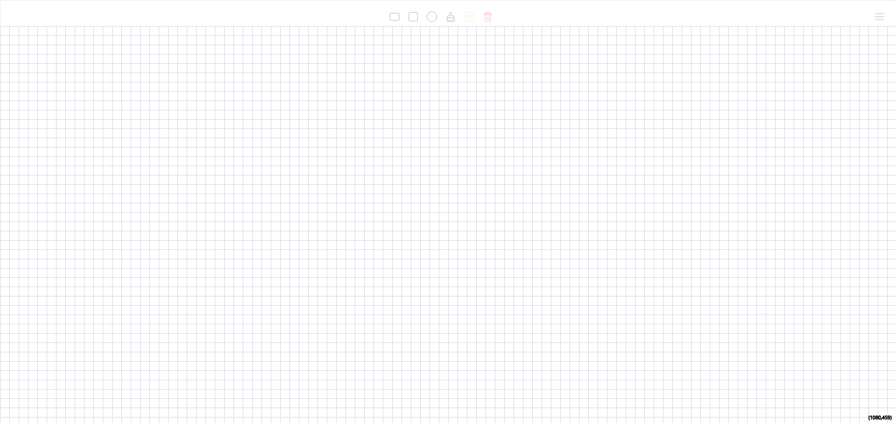
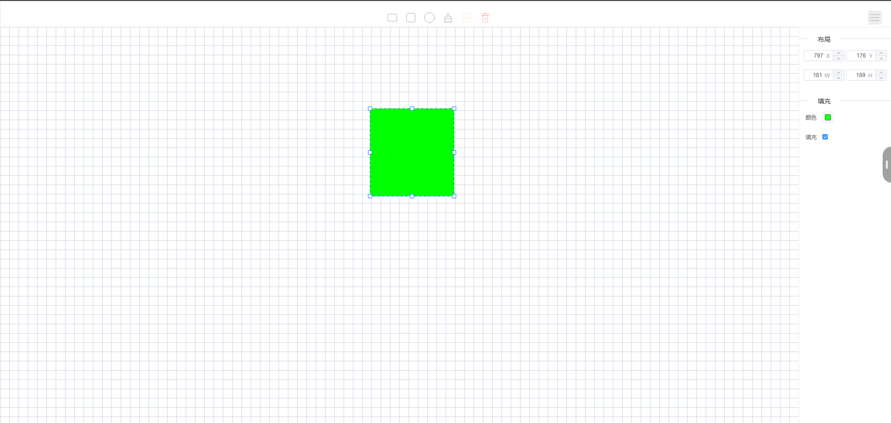
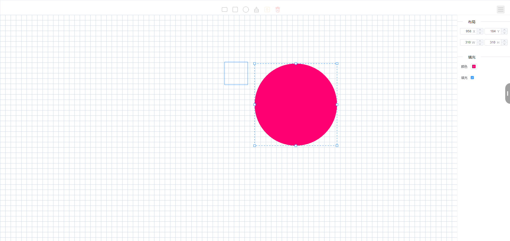

# 基于原生Canvas + Vue的绘图面板

> 基于canvas绘制，mitt事件驱动的绘图面板

## 技术栈学习

- (Canvas)[https://developer.mozilla.org/zh-CN/docs/Web/API/Canvas_API#%E5%8F%82%E8%80%83]
- (Vue)[https://cn.vuejs.org/]
- (Mitt)[https://www.npmjs.com/package/mitt]

## 预览

**主面板**

**属性面板-1**

**属性面板-2**

